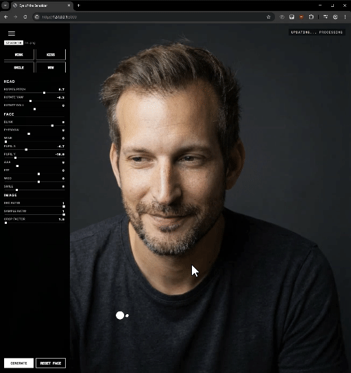

# Eye of the Beholder

A real-time facial expression editing interface powered by ComfyUI.



## Description
This web application allows you to upload an image and manipulate facial features (like wink, smile, head rotation) using an intuitive UI. It communicates with a local ComfyUI instance to generate results.

It also supports **OSC (Open Sound Control)** input, allowing you to drive the gaze/face direction using external tracking hardware (like a Kinect) via TouchDesigner.

## Prerequisites
- Node.js installed
- [ComfyUI](https://github.com/comfyanonymous/ComfyUI) running locally on `http://127.0.0.1:8188`
- [ComfyUI-AdvancedLivePortrait](https://github.com/PowerHouseMan/ComfyUI-AdvancedLivePortrait) nodes installed in ComfyUI
- [ComfyUI-TempFileDeleter](https://github.com/neeltheninja/ComfyUI-TempFileDeleter) (Recommended to prevent disk filling)
- (Optional) [TouchDesigner](https://derivative.ca/) for Kinect tracking

## Setup & Run

1. Install dependencies:
   ```bash
   npm install
   ```

2. Start the server:
   ```bash
   node server.js
   ```

3. Open your browser at `http://localhost:3000`.

## Usage
1. Upload a source image.
2. Use the sliders or quick action buttons (WINK, KISS, SMILE, WOW) to change expressions.
3. Drag the white circle on the screen to control the gaze direction.

### 6x6 Grid Generation & Preview
You can automate the creation of a 36-frame (6x6) interactive sprite set:
1. Ensure your image is uploaded and looks correct.
2. Click **Generate 6x6 Grid** in the control panel. The system will automatically map 36 coordinate points across the active preview area, generate each image through ComfyUI, and save them to `public/grid_images/`.
3. Once complete, navigate to `http://localhost:3000/preview.html`. This standalone page will preload the 36 images and perfectly track your mouse position using the generated assets, creating an interactive "eyes follow the mouse" effect without needing a GPU!

### OSC & Kinect Tracking
You can control the gaze direction using a Kinect (or any OSC source).

1.  **TouchDesigner Setup:**
    -   Open the included file: `touchdesigner_facetrack_OSC.toe`.
    -   This file reads Kinect data and sends normalized X/Y coordinates via OSC.
    -   **Settings:**
        -   Address: `127.0.0.1`
        -   Port: `3333`
        -   Channels: `x`, `y` (Normalized 0-1)
        -   **Numeric Format:** `Float (32 bit)` (Crucial!)

2.  **In the App:**
    -   The "OSC Status" indicator in the sidebar will show "Connected" when the server is ready.
    -   It will flash green when receiving data.
    -   Use the **Polling Rate** slider to limit how often the app asks ComfyUI to generate a new image (0 = Max Speed, 2000 = every 2 seconds). This prevents overloading your GPU.
